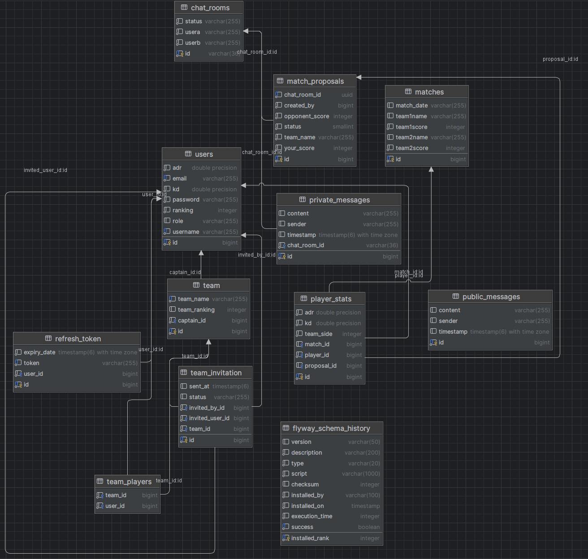
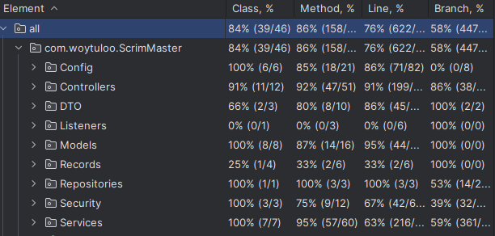

# ScrimMaster

ScrimMaster is a modern platform for organizing and managing esports matches and teams. The application allows you to create teams, invite players, accept join requests, organize scrims, run chats, and track both individual and team statistics.

---

## Architecture Overview

* **Frontend:** React 18+, TypeScript, Material UI – a modern, fast, responsive interface.
* **Backend:** Spring Boot 3 (Java 21+) – REST API, business logic, security, WebSocket/Kafka support.
* **Database:** PostgreSQL – relational, transactional database for users, teams, and matches data.
* **Docker:** possibility to run the entire stack in containers.
* **Notifications:** WebSocket/Kafka – real-time notifications about invitations and match results.

---

## Getting Started

### Backend

1. Requirements: Java 21+, Maven, PostgreSQL.
2. Configure the database (e.g., create a `scrimmaster` database, set user/password in `application.yml`).
3. Build and run:

   ```
   cd backend
   mvn clean install
   mvn spring-boot:run
   ```

### Frontend

1. Requirements: Node.js 18+, npm or pnpm.
2. Install dependencies:

   ```
   cd frontend
   npm install
   ```
3. Start the app:

   ```
   npm start
   ```
4. By default, the frontend runs on port 3000, backend on 8080.

---

## ERD Diagram


Example relationships:

* **User** (`id`: PK, `username`: unique, `email`: unique, `password`)
* **Team** (`id`: PK, `name`: unique, `captain_id`: FK → User)
* **Team\_Player** (`team_id`: FK, `user_id`: FK) — join table, many-to-many relationship
* **Match** (`id`: PK, `team1_id`, `team2_id`, `date`, `score1`, `score2`)
* **ChatRoom** (`id`: PK, `userA_id`, `userB_id`)
* **TeamInvitation** (`id`: PK, `team_id`: FK, `invited_user_id`: FK, `status`, `created_at`)

All relationships are visible in the diagram. The `Team_Player` table represents the N\:M relationship between players and teams.

---
## Tests


The project includes a comprehensive set of unit and integration tests that cover all key backend functionalities.
All API endpoints are tested, including registration, login, password change, team management, and invitation handling. 
The tests are written using **JUnit 5** and **Spring Boot Test**, ensuring automatic verification of business logic, 
input validation, and edge cases.

All endpoints have at least one test that checks the expected behavior and error handling. 

Below is a screenshot showing the achieved test coverage for the project.

To run all tests locally, use the following command:

```bash
./mvnw test
```


---

## Technologies Used

* **React 18 + TypeScript** – fast SPA development, popular framework, type safety improves code quality, large community.
* **Material UI** – ready-to-use component library, allows building responsive and modern interfaces.
* **Spring Boot 3 (Java 21+)** – secure, fast backend, REST API, extensive integration options, support for WebSocket and Kafka.
* **PostgreSQL** – relational database, great for relationships, transactions, and indexing.
* **Docker** – enables quick deployment of the application locally or in production.
* **WebSocket/Kafka** – allows for real-time notifications and event-driven architecture, easy to expand in the future.

---

## Summary

ScrimMaster is a modern, scalable platform for managing matches, teams, and communication in esports, based on the best current frontend and backend technologies.


